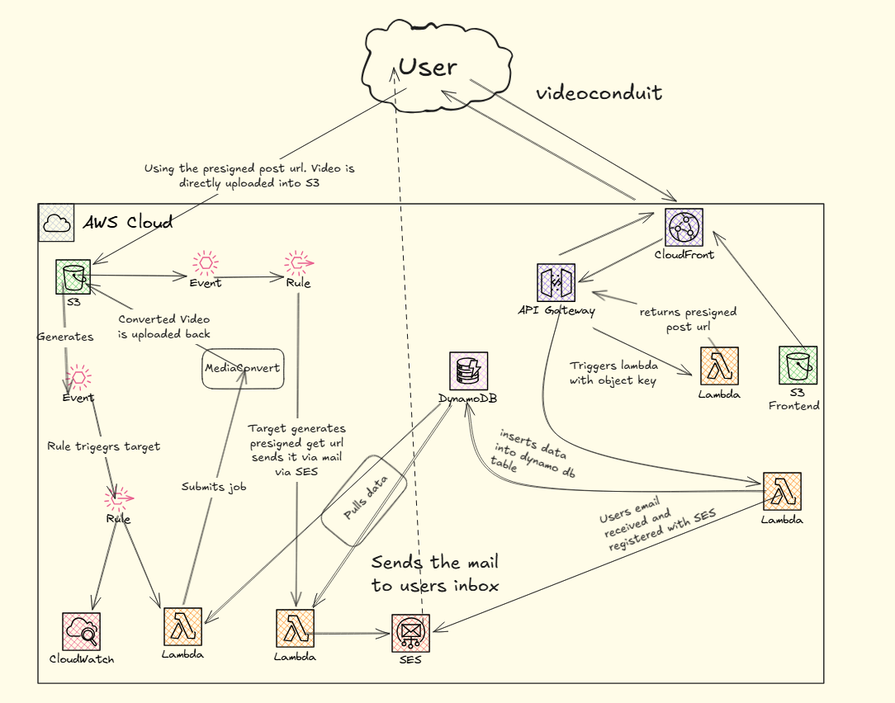

# Videoconduit

**Videoconduit** is a project to manipulate video: audio extraction, resizing, and related processing.

## Branches

This repository has three branches:

| Branch | Purpose |
|--------|---------|
| **frontend** | Client-side web app: UI and static assets. |
| **lambda_code** | AWS Lambda function code. |
| **main** | Infrastructure as code (Terraform). |

## Configure the API base URLs (required)

After you run `terraform apply` in the `main` branch, API Gateway outputs an API base URL. **You must copy those URLs into the frontend JavaScript** so the UI calls your deployed API.

1. Open the Terraform outputs (or the API stage URL shown after apply).
2. In the **frontend** project, set the same base URL in your script, for example:

```javascript
const API = 'https://xxxxx.execute-api.ap-south-1.amazonaws.com/prod';
const EMAIL_API = 'https://xxxxx.execute-api.ap-south-1.amazonaws.com/prod/email';
```

Replace the host and path with the values from your own deployment. The exact strings will differ; use what Terraform / API Gateway gives you.

---

## Architecture

For a full walkthrough of the design, see the Medium article: [My own video conversion application — Videoconduit](https://medium.com/@shahin.sheikh1337/my-own-video-conversion-application-videoconduit-b6cfa22ab3b0).



---

## More projects

Other work is summarized on the portfolio: [Projects](https://shadowchild.zita.click/project.html).
